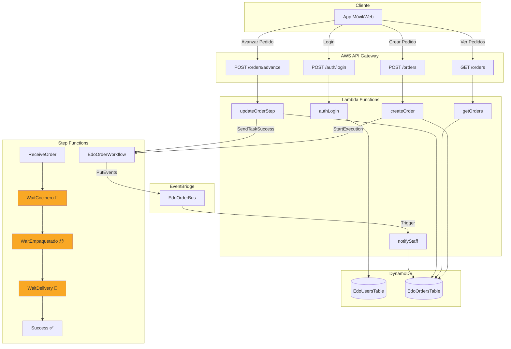
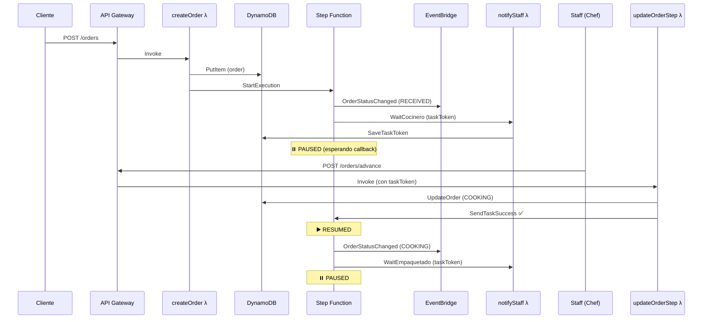
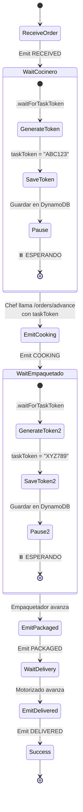

# 🍣 Edo Sushi Bar - Arquitectura del Sistema

## Diagrama de Arquitectura



## Flujo de Trabajo Detallado



## Callback Pattern - Explicación Visual



## Modelo de Datos Multi-Tenant

```mermaid
erDiagram
    EdoUsersTable ||--o{ EdoOrdersTable : "pertenece a tenant"
    
    EdoUsersTable {
        string email PK
        string password
        string role
        string tenant_id
        string staff_type
    }
    
    EdoOrdersTable {
        string tenant_id PK
        string order_id SK
        string customer_email
        array items
        number total
        string status
        string task_token
        number created_at
        number updated_at
    }
```

## Estados del Pedido


## Eventos de EventBridge

Todos los cambios de estado emiten eventos al `EdoOrderBus`:

```json
{
  "source": "edo.orders",
  "detail-type": "OrderStatusChanged",
  "detail": {
    "order_id": "abc-123",
    "tenant_id": "sede-miraflores",
    "status": "COOKING",
    "timestamp": "2024-01-15T10:30:00Z"
  }
}
```

## Roles y Permisos

| Rol | Permisos |
|-----|----------|
| **CLIENTE** | • Crear pedidos<br>• Ver sus propios pedidos |
| **STAFF** | • Ver todos los pedidos del tenant<br>• Avanzar pedidos (con taskToken)<br>• Recibir notificaciones |

## Escalabilidad Multi-Tenant

Cada sede (tenant) tiene:
- ✅ Aislamiento de datos por `tenant_id`
- ✅ Staff dedicado por sede
- ✅ Flujos de trabajo independientes
- ✅ Métricas separadas en CloudWatch

### Ejemplo de Tenants

```
sede-miraflores
├── Chef: chef@miraflores.com
├── Empaquetador: emp@miraflores.com
└── Motorizado: delivery@miraflores.com

sede-surco
├── Chef: chef@surco.com
├── Empaquetador: emp@surco.com
└── Motorizado: delivery@surco.com
```

## Costos Estimados (DEV)

Con uso bajo a moderado:

| Servicio | Costo Mensual |
|----------|---------------|
| Lambda | ~$0.20 |
| DynamoDB On-Demand | ~$2.50 |
| Step Functions | ~$0.25 |
| API Gateway | ~$1.00 |
| EventBridge | ~$0.10 |
| **TOTAL** | **~$4.05/mes** |

> 💡 En producción con mayor tráfico, los costos escalan según uso real.

## Ventajas de esta Arquitectura

✅ **Serverless**: Escalado automático, pago por uso  
✅ **Event-Driven**: Desacoplamiento mediante EventBridge  
✅ **Resiliente**: Reintentos automáticos en Step Functions  
✅ **Auditable**: Historial completo de eventos  
✅ **Multi-Tenant**: Aislamiento por sede  
✅ **Sin Cognito**: Autenticación custom con DynamoDB  

## Próximas Mejoras

1. **WebSockets** para actualizaciones en tiempo real
2. **S3** para almacenar imágenes de platos
3. **CloudFront** para CDN
4. **SNS** para notificaciones push
5. **SES** para emails transaccionales
6. **X-Ray** para tracing distribuido
